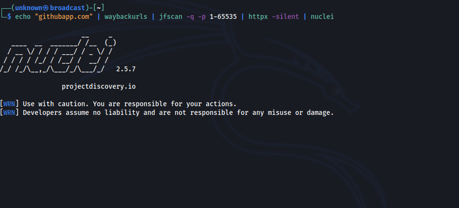

# Description
The JFScan (Just Fu*king Scan) is a wrapper around a super-fast network scanner Masscan. It's designed to simplify work when scanning for open ports on targets in mixed formats, inluding domain names. Some useful modules are included, such as modules for subdomain enumeration using Amass and crt.sh. The JFScan accepts a target in the following forms: URL, domain or IP (including CIDR). You can specify a file with targets using argument or just use stdin. The JFScan also allows you to output only the results and chain it with other tools, for example Nuclei.


# Usage


Please follow installation instructions before running. Do not run the JFScan under a root, it's not needed since we set a special permissions on the masscan binary.

```
usage: jfscan [-h] -t TARGETS [-m MODULES] (-p PORTS | -tp TOP_PORTS) [-r MAX_RATE] [-oi] [-od] [-q]

JFScan - Just Fu*king Scan

optional arguments:
  -h, --help            show this help message and exit
  -t TARGETS, --targets TARGETS
                        list of targets, accepted form is: domain name, IPv4, IPv6, URL
  -m MODULES, --modules MODULES
                        modules separated by a comma, available modules: enum_amass, enum_crtsh
  -p PORTS, --ports PORTS
                        ports, can be a range or port list: 0-65535 or 22,80,100-500,...
  -tp TOP_PORTS, --top-ports TOP_PORTS
                        scan only N of the top ports, e. g., --top-ports 1000
  -r MAX_RATE, --max-rate MAX_RATE
                        max kpps rate
  -oi, --only-ips       output only IP adresses, default: all resources
  -od, --only-domains   output only domains, default: all resources
  -q, --quite           output only results
```

## Example
Scan targets for only for ports 80 and 443 with rate of 10 kpps:

`$ jfscan -p 80,443 -t targets.txt -r 10000`

Scan targets for only for ports 80 and 443 and utilize a crt.sh subdomain enumeration modules:

`$ jfscan -p 80,443 -t targets.txt -m enum_crtsh`

Scan targets for top 1000 ports and utilize crt.sh module:

`$ jfscan --top-ports 1000 -t targets.txt -m enum_crtsh`

You can also specify targets on stdin and pipe it to nuclei:

`$ cat targets.txt | jfscan --top-ports 1000 -m enum_crtsh | httpx -silent | nuclei`

The targets.txt can contain targets in the following forms:
```
http://domain.com/
domain.com
1.2.3.4
1.2.3.0/24
```

# Installation
1. Before installation, make sure you have the latest version of Masscan installed (tested version is 1.3.2).

First, install a libpcap-dev (Debian based distro) or libcap-devel (Centos based distro):

```
sudo apt install libpcap-dev
```

Next, clone the official repository and install:
```
sudo apt-get --assume-yes install git make gcc
git clone https://github.com/robertdavidgraham/masscan
cd masscan
make
sudo make install
```


1. The Masscan requires root permissions to run. Since running binaries under root is not good idea, we will set a CAP_NET_RAW capability to the binary:

```
sudo setcap CAP_NET_RAW+ep /usr/bin/masscan
```

3. For installation of JFscan a python3 and pip3 is required.

```
sudo apt install python3 python3-pip
```

4. Install JFScan:
```
$ git clone https://github.com/nullt3r/jfscan.git
$ cd jfscan
$ pip3 install .
```
If you can't run the jfscan directly from command line you should check if $HOME/.local/bin is in your path.

Add the following line to your `~/.zshrc` or `~/.bashrc`:

```
export PATH="$HOME/.local/bin:$PATH"
```

5. Additional steps:
For enum_amass module to work, install Amass:
```
snap install amass
```

# License
Read file LICENSE.

# Disclaimer
I am not responsible for any damages. You are responsible for your own
actions. Attacking targets without prior mutual consent is illegal.

# Known issues
* Running enum_amass will take forever if there is more then 10 domains on the input.

# TODO
* Transfer Resources object to a database (SQLite). It's getting too complex.
* Update logging, create new logging class for each usecase.