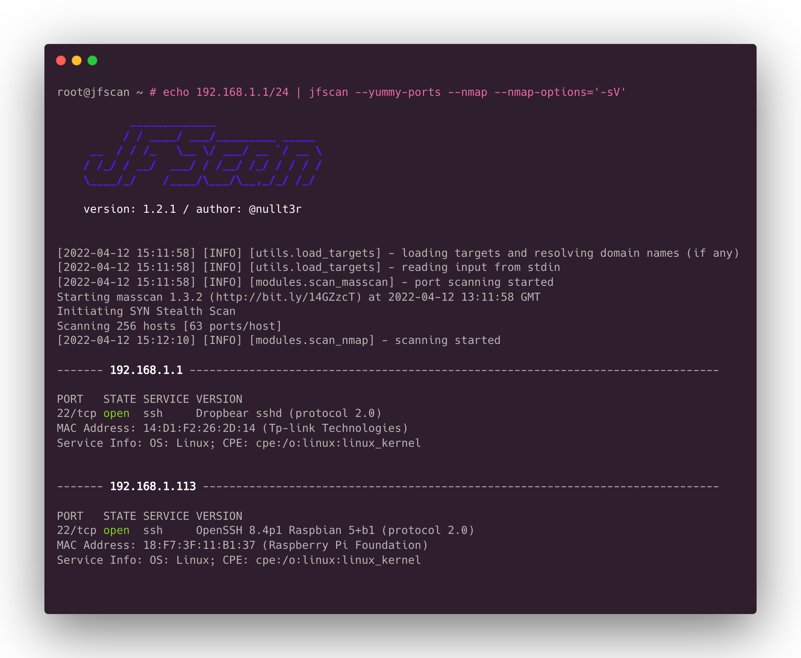
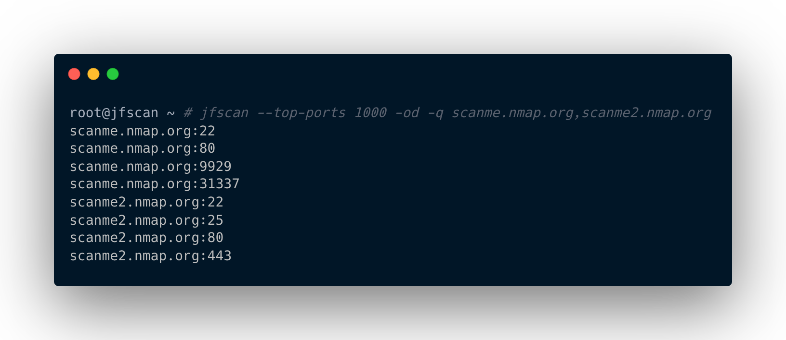
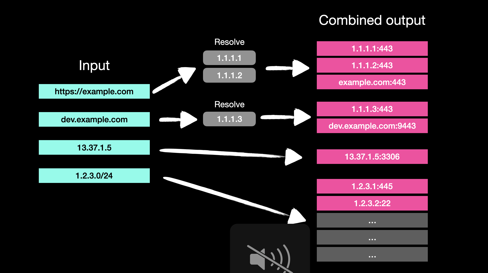

  
[](https://github.com/psf/black)

# Description
## Killing features
* Unleash the power of Nmap with Masscan for large-scale scans
* Scan targets using domain names and other formats
* Output results in a clean domain:port format
* Stream results to and from other tools using stdin/stdout mode
* Enjoy hassle-free scanning with automatic packet rate adjustment for Masscan
* Generate professional-grade Nmap XML reports
* Scan IPv6 targets without any issues
* Stay focused and on target with scope control

Turn never-ending Nmap scans into 5 minutes. The JFScan (Just Fu*king Scan) is a wrapper around a super-fast port scanner Masscan and Nmap. It's designed to simplify work when scanning for open ports on targets in a variety of formats. The JFScan accepts a target in the following forms: URL, domain, or IP (including CIDR). You can specify a file with targets using argument or use stdin.

The JFScan also allows you to output only the results and chain it with other tools like Nuclei. The domain:port output of JFScan is crucial if you want to discover vulnerabilities in web applications as the virtual host decides which content will be served.

Finally, it can scan discovered ports with Nmap. You can also define custom options and use Nmap's amazing scripting capabilities.





JFScans logic of input & output processing:



# Usage
```
usage: jfscan [-h] [--targets TARGETS] (-p PORTS | --top-ports TOP_PORTS | --yummy-ports) [--resolvers RESOLVERS] [--enable-ipv6] [--scope SCOPE] [-r MAX_RATE] [--wait WAIT] [--disable-auto-rate] [-i INTERFACE] [--source-ip SOURCE_IP]
              [--router-ip ROUTER_IP] [--router-mac ROUTER_MAC] [--router-mac-ipv6 ROUTER_MAC_IPV6] [-oi] [-od] [-o OUTPUT] [-q | -v] [--nmap] [--nmap-options NMAP_OPTIONS] [--nmap-threads NMAP_THREADS] [--nmap-output NMAP_OUTPUT] [--version]
              [target]

JFScan - Just Fu*king Scan

optional arguments:
  -h, --help            show this help message and exit
  -p PORTS, --ports PORTS
                        ports, can be a range or port list: 0-65535 or 22,80,100-500,...
  --top-ports TOP_PORTS
                        scan only N of the top ports, e. g., --top-ports 1000
  --yummy-ports         scan only for the most yummy ports
  -q, --quite           output only results
  -v, --verbose         verbose output

  --nmap                run nmap on discovered ports
  --nmap-options NMAP_OPTIONS
                        nmap arguments, e. g., --nmap-options='-sV' or --nmap-options='-sV --script ssh-auth-methods'
  --nmap-threads NMAP_THREADS
                        number of nmaps to run concurrently, default 8
  --nmap-output NMAP_OUTPUT
                        output results from nmap to specified file in standard XML format (same as nmap option -oX)

  target                a target or targets separated by a comma, accepted form is: domain name, IPv4, IPv6, URL
  --targets TARGETS     file with targets, accepted form is: domain name, IPv4, IPv6, URL

  -oi, --only-ips       output only IP adresses, default: all resources
  -od, --only-domains   output only domains, default: all resources
  -o OUTPUT, --output OUTPUT
                        output masscan's results to specified file

  --resolvers RESOLVERS
                        custom resolvers separated by a comma, e. g., 8.8.8.8,1.1.1.1
  --enable-ipv6         enable IPv6 support, otherwise all IPv6 addresses will be ignored in the scanning process
  --scope SCOPE         file path with IP adresses and CIDRs to control scope, expected format: IPv6, IPv4, IPv6 CIDR, IPv4 CIDR
  -r MAX_RATE, --max-rate MAX_RATE
                        max kpps rate for the masscan
  --wait WAIT           a number of seconds to wait for packets to arrive (when scanning large networks), option for the masscan
  --disable-auto-rate   disable rate adjustment mechanism for masscan (more false positives/negatives)
  -i INTERFACE, --interface INTERFACE
                        interface for masscan and nmap to use
  --source-ip SOURCE_IP
                        IP address of your interface for the masscan
  --router-ip ROUTER_IP
                        IP address of your router for the masscan
  --router-mac ROUTER_MAC
                        MAC address of your router for the masscan
  --router-mac-ipv6 ROUTER_MAC_IPV6
                        MAC address of your IPv6 router for the masscan

  --version             show program's version number and exit
```

Please follow installation instructions before running. Do not run the JFScan under a root, it's not needed since we set a special permissions on the masscan binary.

## Example
Scan targets for only for ports 80 and 443 with rate of 10 kpps:

`$ jfscan -p 80,443 --targets targets.txt -r 10000`

Scan targets for top 1000 ports :

`$ jfscan --top-ports 1000 1.1.1.1/24`

You can also specify targets on stdin and pipe it to nuclei:

`$ cat targets.txt | jfscan --top-ports 1000 -q | httpx -silent | nuclei`

Or as positional parameter:

`$ jfscan --top-ports 1000 1.1.1.1/24 -q | httpx -silent | nuclei`

Or everything at once, the JFScan just does not care and scans all the targets specified:

`$ echo target1 | jfscan --top-ports 1000 target2 --targets targets.txt -q | httpx -silent | nuclei`

Utilize nmap to gather more info about discovered services:

`$ cat targets.txt | jfscan -p 0-65535 --nmap --nmap-options="-sV --scripts ssh-auth-methods"`

The targets.txt can contain targets in the following forms (IPv6 similarly):
```
http://domain.com/
domain.com
1.2.3.4
1.2.3.0/24
1.1.1.1-1.1.1.30
```

# Installation
1. Before installation, make sure you have the latest version of Masscan installed (tested version is 1.3.2).

First, install a libpcap-dev (Debian based distro) or libcap-devel (Centos based distro):

```
sudo apt install libpcap-dev
```

Next, clone the official repository and install:
```
sudo apt-get --assume-yes install git make gcc
git clone https://github.com/robertdavidgraham/masscan
cd masscan
make
sudo make install
```


1. The Masscan requires root permissions to run. Since running binaries under root is not good idea, we will set a CAP_NET_RAW capability to the binary:

```
sudo setcap CAP_NET_RAW+ep /usr/bin/masscan
```

3. For installation of JFscan a python3 and pip3 is required.

```
sudo apt install python3 python3-pip
```

4. Install JFScan:
```
$ git clone https://github.com/nullt3r/jfscan.git
$ cd jfscan
$ pip3 install .
```
If you can't run the jfscan directly from command line you should check if $HOME/.local/bin is in your path.

Add the following line to your `~/.zshrc` or `~/.bashrc`:

```
export PATH="$HOME/.local/bin:$PATH"
```

# License
Read file LICENSE.

# Disclaimer
I am not responsible for any damages. You are responsible for your own
actions. Attacking targets without prior mutual consent is illegal.
___

\* *When scanning smaller network ranges, you can just use nmap directly, there is no need to use JFScan. You can reach up to 70% of the speed of JFScan using the following options:*
```
nmap -Pn -n -v yourTargetNetwork/26 -p- --min-parallelism 64 --min-rate 20000 --min-hostgroup 64 --randomize-hosts -sS -sV
```
*As always, expect some false positivies/negatives.*
